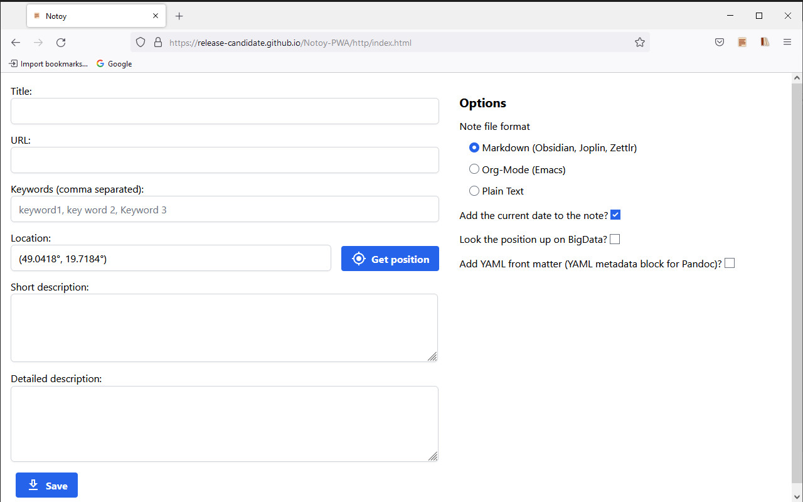
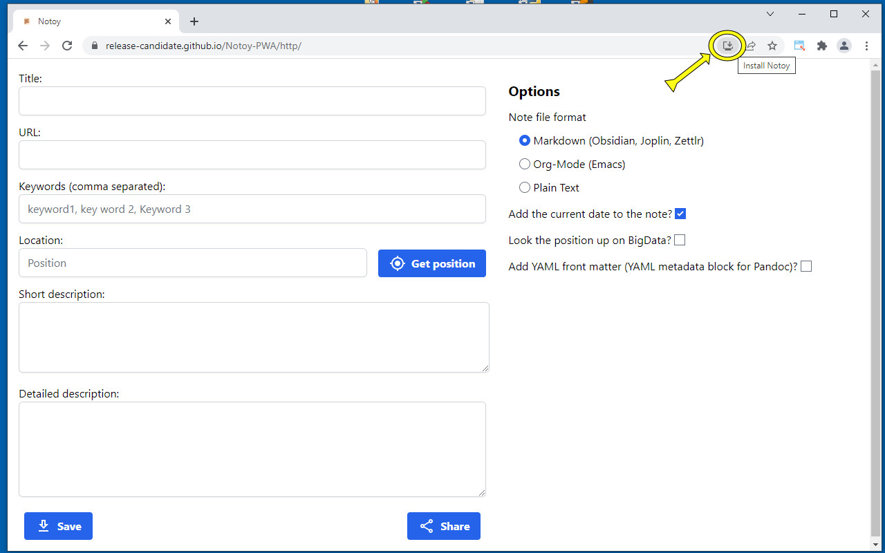
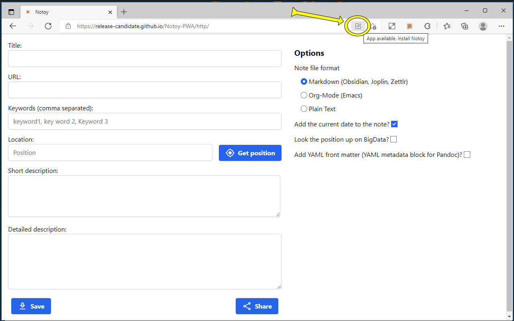
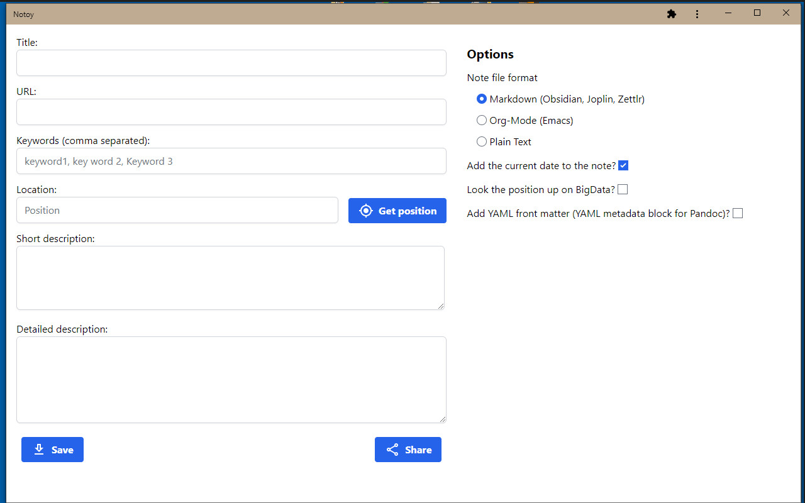
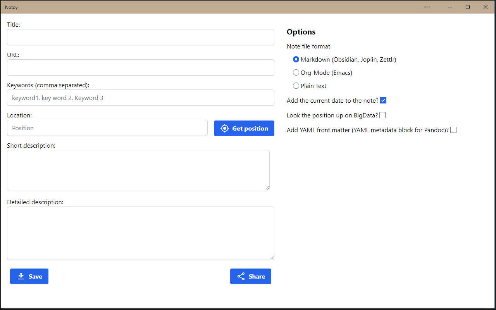

#  Notoy Progressive Web App

Progressive web app to save notes of a website shared to it on a mobile device.

[Notoy PWA at GitHub Pages](https://release-candidate.github.io/Notoy-PWA/http/index.html)

[YouTube video of the app on Android](https://youtu.be/xJgV62jFl-s)

## Privacy Policy

Notoy (the progressive web app) does not send any data at all to any other host as long as the reverse geolocation is disabled in the options - which is the default.

If you enable the option to look the GPS coordinates up at `BigData`, a request is send to `BigData` to get the name of the city this position is nearest to. `BigData` adheres to the the EU General Data Protection Regulations (GDPR) and the Australian Privacy Principles contained in the Privacy Act 1988 (Cth).

The privacy policy of `BigData` can be seen at [BigData Privacy Policy](https://www.bigdatacloud.com/privacy-and-cookie-policy)

## License

The app is licensed under the GPL v3 and newer, see file [LICENSE](./LICENSE)
