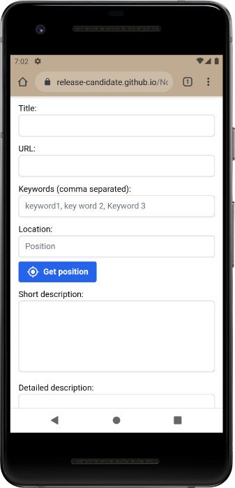

#  Notoy Progressive Web App <!-- omit in toc -->

Notoy is web app to save notes of a website on a mobile device. You can also use and install it as an app on a desktop, but you cannot share an URL from a browser to Notoy. For a video of the mobile usage, see: [YouTube video of the app on Android](https://youtu.be/xJgV62jFl-s)

The app can be found at [Notoy PWA at GitHub Pages](https://release-candidate.github.io/Notoy-PWA/http/index.html)

If you want something comparable for a 'normal' browser, I also made browser extensions called Notoy to work with desktop browsers: [Notoy Browser Extensions](https://github.com/Release-Candidate/Notoy-BrowserExtensions)

- [Links](#links)
- [Usage and Installation](#usage-and-installation)
  - [Installation](#installation)
  - [Usage](#usage)
- [Contributing](#contributing)
- [Privacy Policy](#privacy-policy)
- [License](#license)

## Links

- Link to the app: [Notoy PWA at GitHub Pages](https://release-candidate.github.io/Notoy-PWA/http/index.html)
- Mobile usage: [YouTube video of the app on Android](https://youtu.be/xJgV62jFl-s)
- Dokumentation: [Notoy at Read the Docs](https://readthedocs.org/projects/notoy-pwa/badge/?version=latest)
- The Notoy browser extensions for Chrome, Edge and Firefox: [Notoy Browser Extensions](https://github.com/Release-Candidate/Notoy-BrowserExtensions)

Further Information about some Markdown note programs and Emacs' Org-Mode:

- [Obsidian](https://obsidian.md/)
- [Zettlr](https://zettlr.com/)
- [Joplin](https://joplinapp.org/)
- [Org-Mode website](https://orgmode.org/)

## Usage and Installation

### Installation

Visit the URL [Notoy PWA at GitHub Pages](https://release-candidate.github.io/Notoy-PWA/http/index.html) and you can install the app if you have a mobile device or a computer with Chrome or Edge.

Firefox does not allow to install the app and cannot share the note with other programs or the clipboard. Therefore the `Install`- and `Share`-buttons are missing:

On mobile devices you have to click the `Install Notoy to Home Screen`-badge at the bottom of the site. See: [YouTube video of the app on Android](https://youtu.be/xJgV62jFl-s)

Here you can see the `Install`-button marked in the upper right corner of a Chrome browser. After clicking, the app is installed on your computer.You do only need connection to the internet if you want to get the name of your location from the website `BigData`.

The same `Install`-button on Edge.

Below are two screenshots of the installed app on a computer, the first is using Chrome, the second Edge.

### Usage

See the YouTube video on how to share a website to Notoy and save the note: [YouTube video of the app on Android](https://youtu.be/xJgV62jFl-s)

Notoy can save the note in one of three formats: as markdown to be used with programs like Obsidian, Zettlr, Joplin, ... as an Org-Mode file to use with Emacs or as a simple, plain text file.

## Contributing

Every help is welcome, if you found a bug or want to request a missing feature, go to [Report a Bug or a Feature Request at GitHub](https://github.com/Release-Candidate/Notoy-PWA/issues/new/choose)

For detailed information, see [Contributing at Read the Docs](https://notoy-pwa.readthedocs.io/en/latest/contributing/)

## Privacy Policy

Notoy (the progressive web app) does not send any data at all to any other host as long as the reverse geolocation is disabled in the options - which is the default.

If you enable the option to look the GPS coordinates up at `BigData`, a request is send to `BigData` to get the name of the city this position is nearest to. `BigData` adheres to the the EU General Data Protection Regulations (GDPR) and the Australian Privacy Principles contained in the Privacy Act 1988 (Cth).

The privacy policy of `BigData` can be seen at [BigData Privacy Policy](https://www.bigdatacloud.com/privacy-and-cookie-policy)

## License

The app is licensed under the GPL v3 and newer, see file [LICENSE](./LICENSE)
