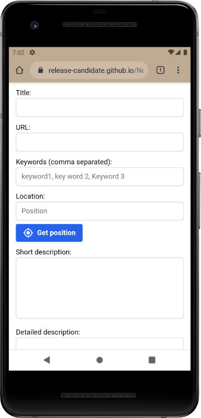

#  Notoy PWA

Information about the [Usage](./usage.md).

The website and app: [Notoy PWA at GitHub Pages](https://release-candidate.github.io/Notoy-PWA/http/index.html)

[YouTube video of the app on Android](https://youtu.be/xJgV62jFl-s)

[Contributing](./contributing.md) has information about how to contribute to Notoy, by filing bug reports or feature requests, to contributing source code, to adding documentation or translations or any other way you can help.

I also made browser extensions called Notoy to work with desktop browsers: [Notoy Browser Extensions](https://github.com/Release-Candidate/Notoy-BrowserExtensions)

Some words on the 'why':

## Why?

This is mainly a project to try PureScript and less a 'serious' attempt at a note app, so the PureScript specific things shown in this app are:

- Mainly writing a progressive web app in PureScript (not the service worker, this is more or less an autogenerated list of files to cache)
- Using Halogen
- Using a PureScript PWA as a share target
- Sharing text from a PureScript PWA
- Using the geolocation API
- Doing reverse geolocation using a web API (using `BigData`'s geolocation services)
- Wrapping callbacks in an `Aff` (`getCurrentPosition` geolocation function)
- Doing JavaScript FFI

## Links

Further Information about some Markdown note programs and Emacs' Org-Mode:

- [Obsidian](https://obsidian.md/)
- [Zettlr](https://zettlr.com/)
- [Joplin](https://joplinapp.org/)
- [Org-Mode website](https://orgmode.org/)
