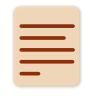

#  Notoy PWA

Information about the [Usage](./usage.md).

The website and app: [Notoy PWA at GitHub Pages](https://release-candidate.github.io/Notoy-PWA/http/index.html)

[YouTube video of the app on Android](https://youtu.be/xJgV62jFl-s)

[Contributing](./contributing.md) has information about how to contribute to Notoy, by filing bug reports or feature requests, to contributing source code, to adding documentation or translations or any other way you can help.

I also made browser extensions called Notoy to work with desktop browsers: [Notoy Browser Extensions](https://github.com/Release-Candidate/Notoy-BrowserExtensions)

## Links

Further Information about some Markdown note programs and Emacs' Org-Mode:

- [Obsidian](https://obsidian.md/)
- [Zettlr](https://zettlr.com/)
- [Joplin](https://joplinapp.org/)
- [Org-Mode website](https://orgmode.org/)
