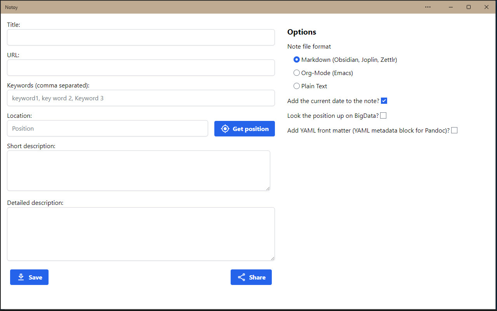

# Installation & Usage

## Installation

Visit the URL [Notoy PWA at GitHub Pages](https://release-candidate.github.io/Notoy-PWA/http/index.html) and you can install the app if you have a mobile device or a computer with Chrome or Edge.

Firefox does not allow to install the app and cannot share the note with other programs or the clipboard. Therefore the `Install`- and `Share`-buttons are missing:

On mobile devices you have to click the `Install Notoy to Home Screen`-badge at the bottom of the site. See: [YouTube video of the app on Android](https://youtu.be/xJgV62jFl-s)

Here you can see the `Install`-button marked in the upper right corner of a Chrome browser. After clicking, the app is installed on your computer.You do only need connection to the internet if you want to get the name of your location from the website `BigData`.

The same `Install`-button on Edge.

Below are two screenshots of the installed app on a computer, the first is using Chrome, the second Edge.

## Usage

See the YouTube video on how to share a website to Notoy and save the note: [YouTube video of the app on Android](https://youtu.be/xJgV62jFl-s)

Notoy can save the note in one of three formats: as markdown to be used with programs like Obsidian, Zettlr, Joplin, ... as an Org-Mode file to use with Emacs or as a simple, plain text file.

## Usage with Your Own Server

You need to have `npm` installed, included with `NodeJS`: [NodeJS Downloads](https://nodejs.org/en/download/)

If you want to host Notoy on your own HTTPS server, checkout the Git repository or unzip the downloaded zip-file. In the `Notoy-PWA` directory, run `npm install` and `npm install purescript` and then `npm run bundle`. Now the Notoy progressive web app is contained in the `http` directory - serve this directory as root `/` using your HTTPS server. You need HTTPS to be able to install the app.
